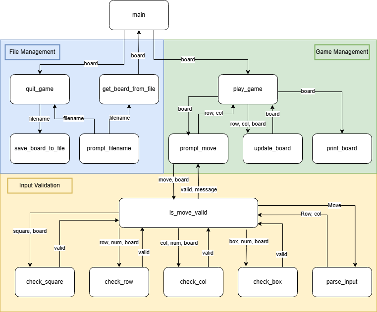
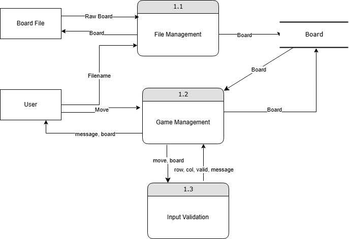

# sudoku-player
 
This program allows a user to play sudoku through the terminal. It's not the easiest way to play sudoku for sure, but it validates moves made and allows saving a board for later, or uploading any other legal 3x3 board.

This project was an exercise in modularization design. 

Hopefully, it will be an exercise in complex algorithm design as well. I plan to make a puzzle solver capable even of completing the hardest board known to man.

_All the information below can be found in sudoku-design.pdf._

## Here's the initial structure chart:



## And the data flow diagram:




## As well as some pseudocode:

### My own work (parse_input): 
```
FUNCTION parse_input ( move ) -> tuple(int, int) 
  // Returns 0,0 if  move is invalid 
  invalid <-- tuple (0, 0) 
   
  IF move.Length != 2 
    return invalid 
  TRY  
move <-- tuple( ascii of move[0].lower() - ascii offset,              
string(move[1])) 
  EXCEPT 
    return invalid 
 
IF move[0] > 0 AND move[0] < 10 AND move[1] > 0 AND move[1] < 
10 
  return move 
 ```
 
### AI & Human collaborative Work: 
 
###### My prompt: 
I need pseudocode for a function in a sudoku program, a function called is_move_valid. This 
program will receive as parameters: 
-  A string (user input for a board space, e.g. “B5”) 
-  a string (the number the user would like to insert at said space) 
-  the current board (2d list) 
The function will return: 
-  bool indicating validity of move 
-  message to display to user (what’s wrong with their input, or potential success message) 
The function will call the following functions: 
-  parse_input - returns tuple (row, col) from user’s input, or 0,0 if invalid 
-  check_square (row, col, board) -> bool  ;  checks the square the user is trying to edit 
-  check_row (row, num, board) -> bool 
-  check_col  (row, num, board) -> bool 
-  check_box  (row, num, board) -> bool 
 
Parse_input will determine if the board space input has errors. Is_move_valid() is responsible 
for validating all the rest. Use normal 9x9 sudoku rules. 
 
 
 
###### AI Code: 
```
function is_move_valid(user_input, num, board): 
    //  Step 1: Parse the user input to get row, col 
    (row, col) = parse_input(user_input) 
 
    //  Step 2: Check if the input is invalid (invalid row, col) 
    if row == 0 and col == 0: 
        return (False, "Invalid input. Please enter a valid board position (e.g., 'A1', 'C5').") 
 
    //  Step 3: Check if the cell is already occupied 
    if board[row][col] != 0: 
        return (False, "This space is already occupied. Choose an empty space.") 
 
    //  Step 4: Check if the number is valid in the current row 
    if not check_row(row, num, board): 
        return (False, "The number already exists in this row. Try another number.") 
 
    //  Step 5: Check if the number is valid in the current column 
    if not check_col(col, num, board): 
        return (False, "The number already exists in this column. Try another number.") 

    //  Step 6: Check if the number is valid in the 3x3 sub-box 
    if not check_box(row, col, num, board): 
        return (False, "The number already exists in this 3x3 sub-box. Try another number.") 
 
    //  Step 7: Check if the number is valid in the square the user is trying to edit 
    if not check_square(row, col, board): 
        return (False, "The move is not valid for this square. Try again.") 
 
    //  Step 8: If all checks pass, return success message 
    return (True, "Move is valid. Good job!") 
 ```
 
 
###### My response: 
Please also provide the pseudocode for its respective helper functions (all except parse_input) 
 
###### AI code: 
```
function check_square(row, col, board): 
    //  Calculate the top-left corner of the 3x3 sub-box 
    start_row = (row // 3) * 3 
    start_col = (col // 3) * 3 
 
    //  Loop through the 3x3 sub-box 
    for i from start_row to start_row + 2: 
        for j from start_col to start_col + 2: 
            //  If the number already exists in this 3x3 box, return 
False 
            if board[i][j] == num: 
                return False 
 
    //  If no conflicts, return True 
    return True 
 
 
function check_row(row, num, board): 
    //  Loop through all columns in the given row 
    for col from 0 to 8: 
        //  If the number already exists in the row, return False 
        if board[row][col] == num: 
            return False 
 
    //  If no conflicts, return True 
    return True 
 
 
function check_col(col, num, board): 
    //  Loop through all rows in the given column 
    for row from 0 to 8: 
        //  If the number already exists in the column, return False 
        if board[row][col] == num: 
            return False 
 
    //  If no conflicts, return True 
    return True 
 
 
 
function check_box(row, col, num, board): 
    //  Calculate the top-left corner of the 3x3 sub-box 
    start_row = (row // 3) * 3 
    start_col = (col // 3) * 3 
 
    //  Loop through the 3x3 sub-box 
    for i from start_row to start_row + 2: 
        for j from start_col to start_col + 2: 
            //  If the number already exists in this 3x3 box, return 
False 
            if board[i][j] == num: 
                return False 
 
    //  If no conflicts, return True 
    return True 
 ```
 
###### My response: 
Check_square should identify if the user-selected space is already occupied, rather than 
checking the 3x3 box it belongs to. Please rewrite 
 
###### AI code: 
```
function check_square(row, col, board): 
    //  Check if the cell is already occupied 
    if board[row][col] != 0: 
        return False  //  The space is occupied by another number 
 
    //  If the cell is empty, return True 
    return True
```